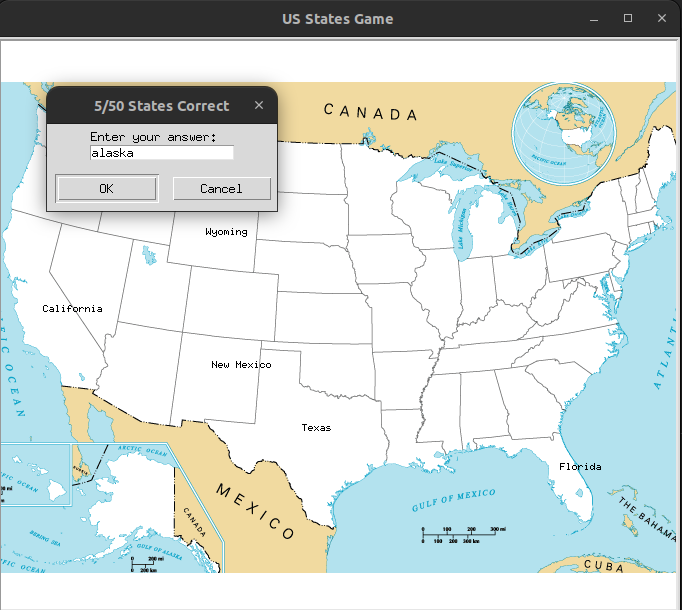
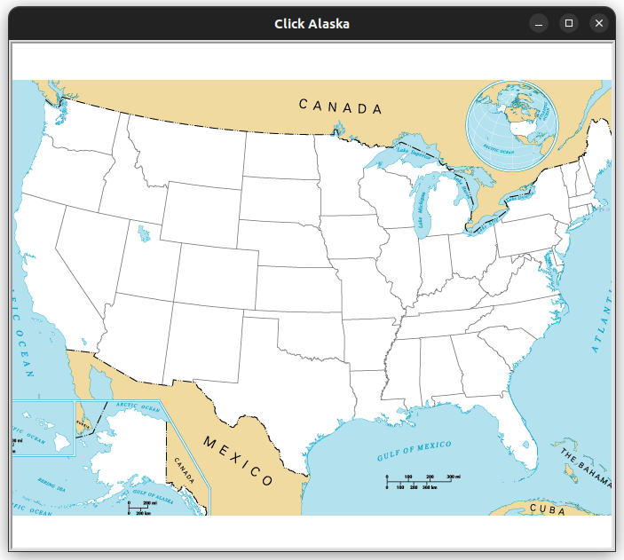

# US States Game

Tejas Acharya [twitter]()

A guessing game about the states of USA. The main game is in 'main.py'. To reconfigure the state co-ordinates stored in 'state_coords.csv', run 'state_coords.py'. States that have not been guessed are saved in 'states_to_learn.csv'. Type 'Exit' to end the game.

### Requirements:

[Turtle]()
[Pandas]()

To Run:

```sh
git clone git@github.com:achte-2022/US-States-Game.git
cd US-States-Game
python3 main.py
```

### Game Screen of main.py:



### Game Screen of state_coords.py:


